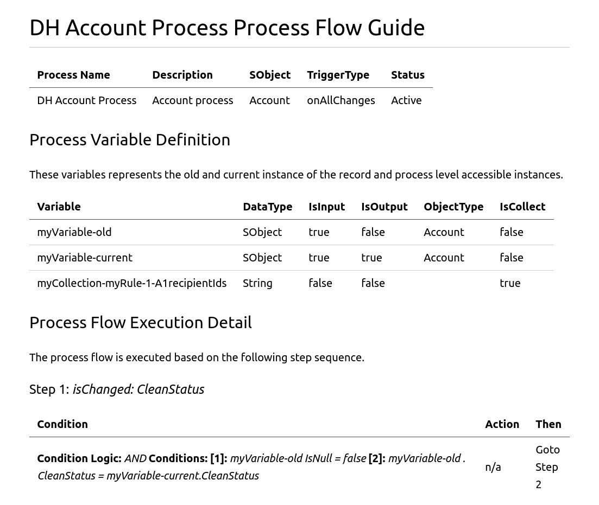

# A salesforce process flow definition Viewer

This utility enable the user to convert process flow XML definition file into the markdown file and easily view it in
the markdown viewer

## Technology stack

- JDK 1.8
- Micronaut Framework (include Oracle GraalVM native image build support).


## How to run it

- setup JAVA_HOME
- unzip distributions/process-viewer-shadow.zip
- go to unzipped folder
- run the following terminal script

```zsh
   java -jar libs/process-viewer-all.jar -f:{yourProcess.flow} -o:{yourOutput.md}
```

## PDF manual conversion process
- install node (must be version 10.*.*). Gitbook pdf ouptput only works on node 10.*.* version.
- install gitbook
- open terminal run the following commands
- type "gitbook init"
- update Summary.md to include your pdf.
- type "gitbook pdf" and it will generate book.pdf

**Note**: due to the fact that "\_\_" is reserved for emphasis in markdown, thus we have to use "--" to replace it.

### Account_Process.flow sample

```xml

<?xml version="1.0" encoding="UTF-8"?>
<Flow xmlns="http://soap.sforce.com/2006/04/metadata">
    <actionCalls>
        <processMetadataValues>
            <name>ActionCallType</name>
            <value>
                <stringValue>flow</stringValue>
            </value>
        </processMetadataValues>
        <processMetadataValues>
            <name>flowSelection</name>
            <value>
                <stringValue>DH Client Community Create ChatterGroup for Approved Accounts</stringValue>
            </value>
        </processMetadataValues>
        <name>myRule_11_A1</name>
        <label>Launch Flow</label>
        <locationX>1100</locationX>
        <locationY>200</locationY>
        ...
```

Here is the markdown result



## Next To do

- use Oracle GraalVM to build executable file to run everywhere without setup JDK1.8
- need to add feature to convert markdown to PDF so that the user can view PDF instead of using markdown viewer.
